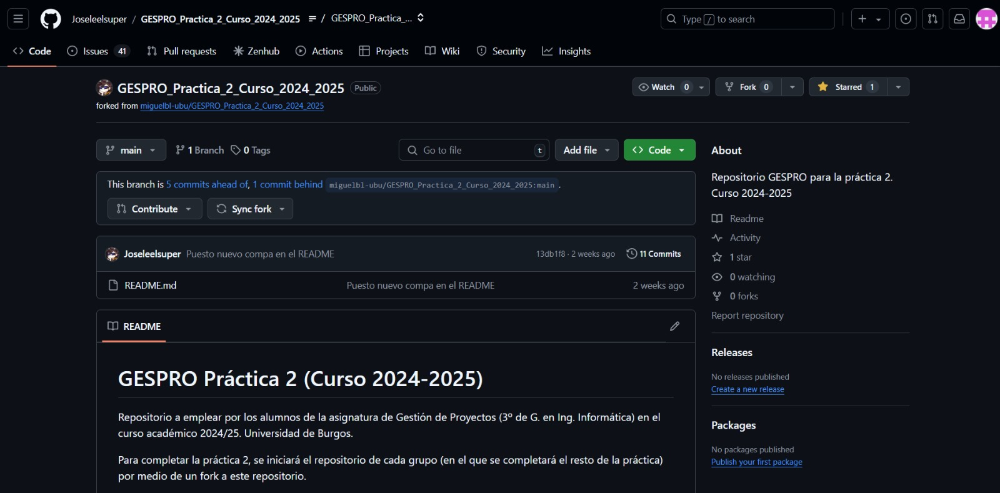
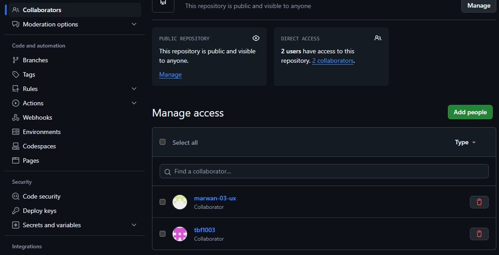
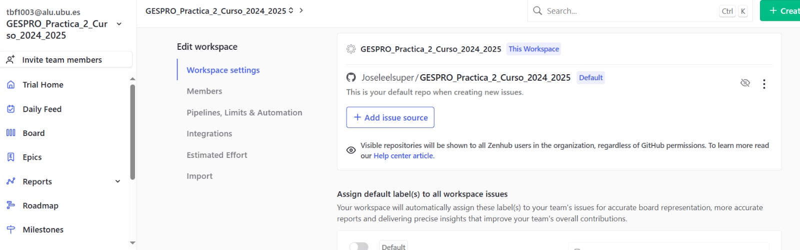
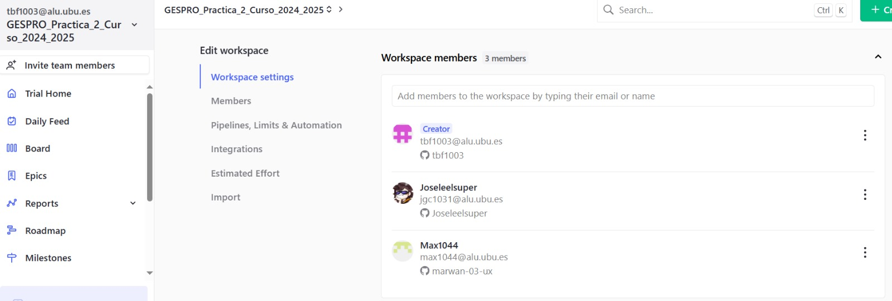
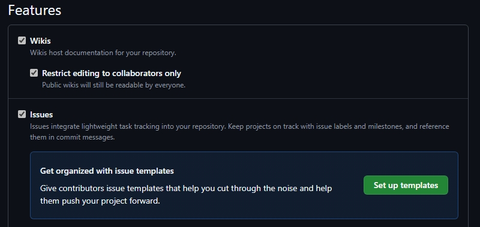
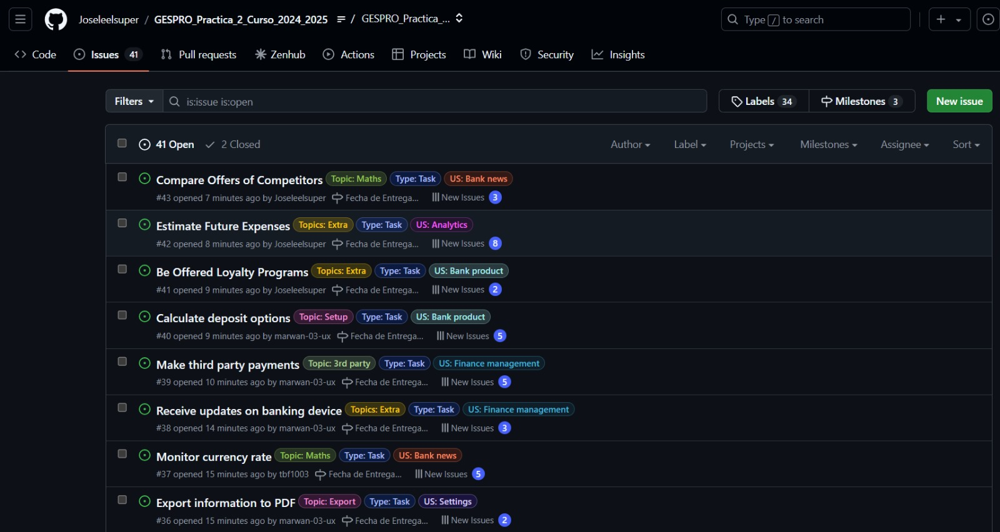
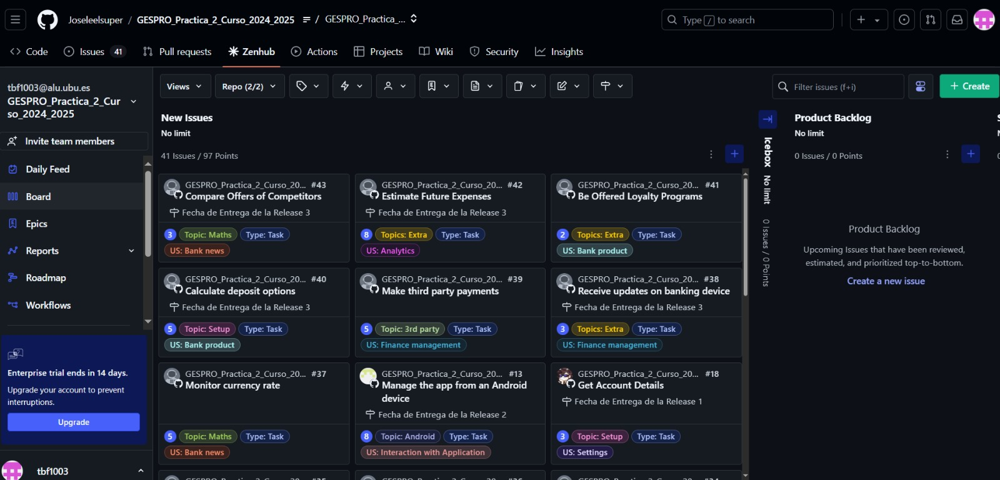

# GESPRO Práctica 2 (Curso 2024-2025)
## Índice
1. [Introducción](#introducción)
2. [Guía de Github-Zenhub](#guía-de-github-zenhub)
3. [Miembros del grupo](#miembros-del-grupo)

## Introducción
Repositorio a emplear por los alumnos de la asignatura de Gestión de Proyectos (3º de G. en Ing. Informática) en el curso académico 2024/25. Universidad de Burgos.

## Guía de Github-Zenhub

Para empezar, se debe de crear el repositorio haciendo un fork al [repositorio original](https://github.com/miguelbl-ubu/GESPRO_Practica_2_Curso_2024_2025) del profesor.

Después, se invita al fork como colaboradores a las personas con las que se va a trabajar en el proyecto.

De manera análoga, se configura Zenhub. Creamos primero un Workspace, invitamos a los colaboradores y lo vinculamos al repositorio de GitHub mencionado anteriormente.

### Habilitar Issues
Para este proyecto, es necesario habilitar los Issues. Para ello, se activa la casilla de Issues en la configuración del repositorio.

Se van a utilizar para crear desde la extensión de Zenhub Issues para las Epics, User Storys y las Tasks.

### Zenhub
Las Issues mencionadas anterioremente las creamos desde la extensión de zenhum clicando a "+ Create". Las dividimos por las etiquetas de Epics, User Storys y Tasks y otros topics.

En la captura siguiente se ven las Epics, User Storys y Tasks creadas:

## Miembros del grupo:

<table>
    <tr>
        <td align="center"><a href="https://github.com/Joseleelsuper"> <b>José Gallardo Caballero</b></a></td>
        <td align="center"><a href="https://github.com/tbf1003"> <b>Tatiana Bejenaru Forostenco</b></a></td>
        <td align="center"><a href="https://github.com/marwan-03-ux"> <b>Marwan Al Hadaddin</b></a></td>
    </tr>
</table>