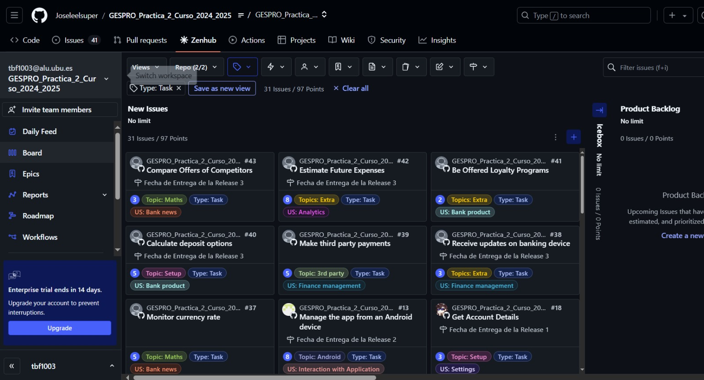
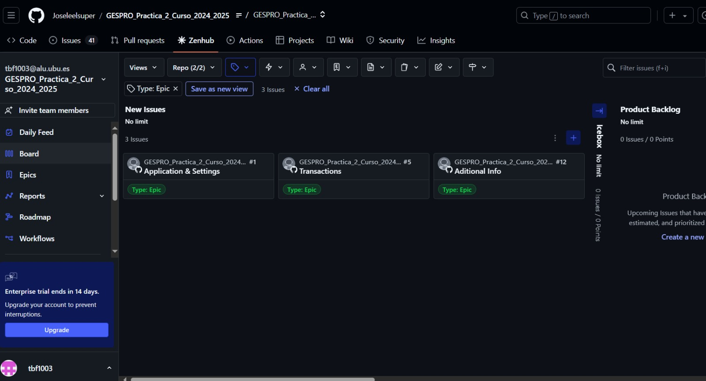
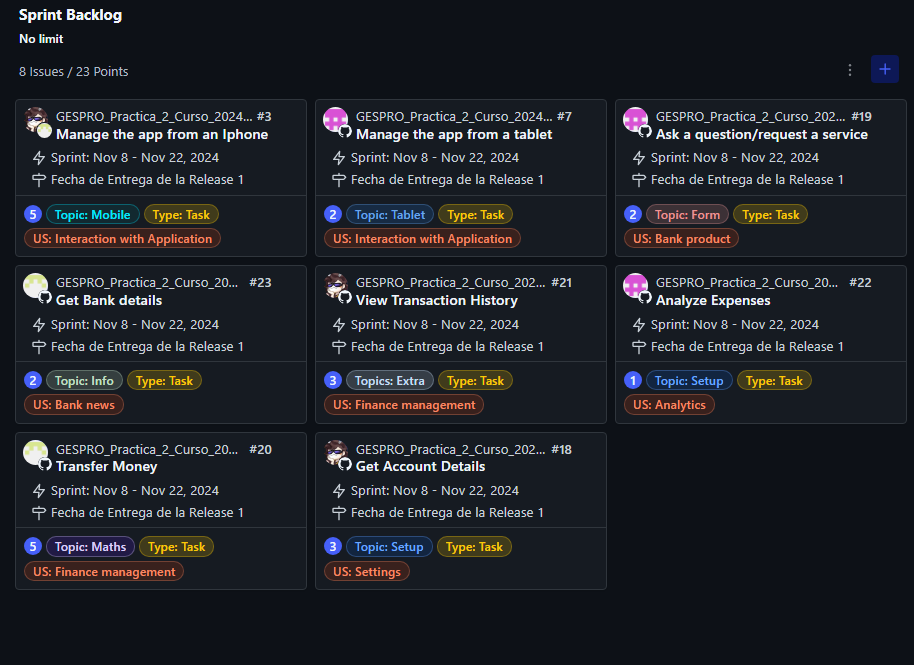
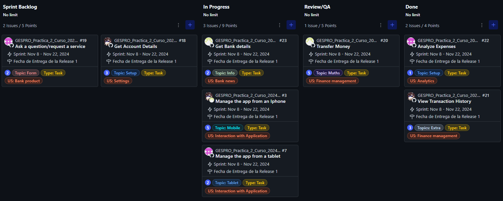
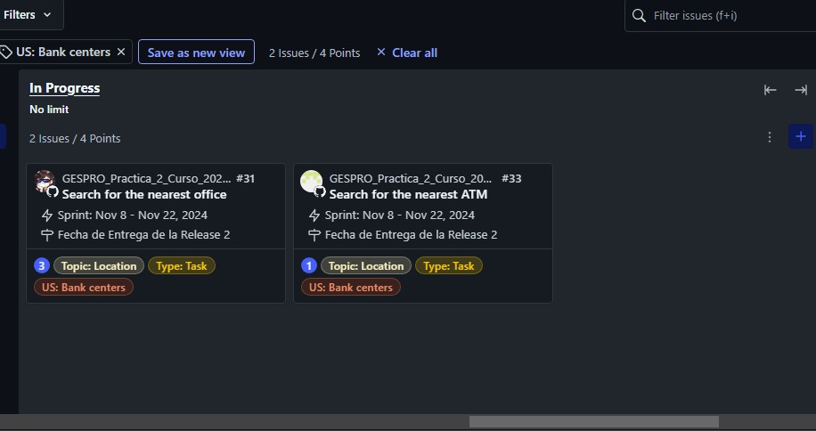
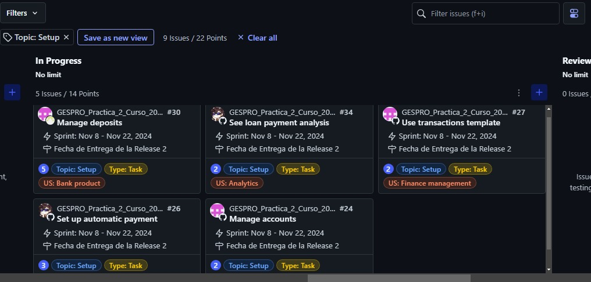
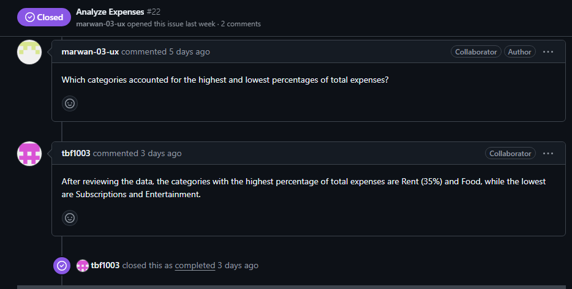
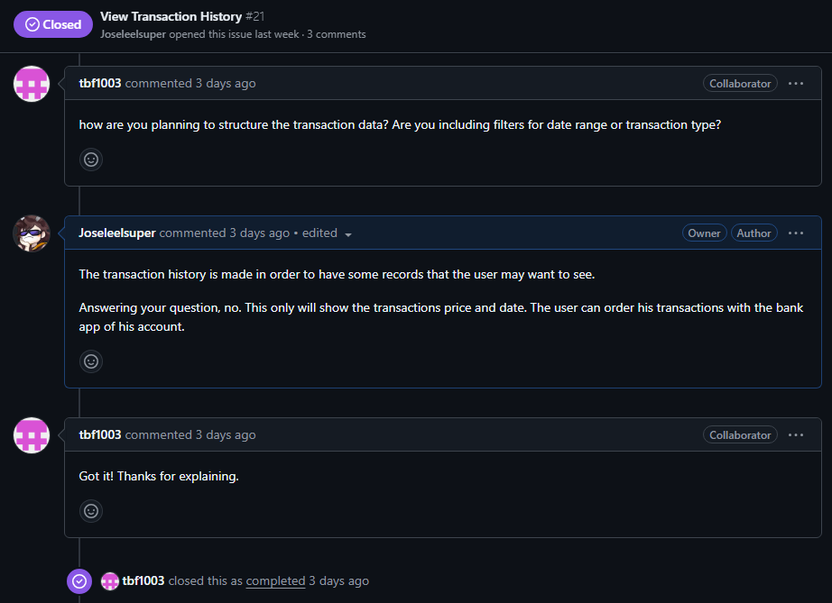

# GESPRO Práctica 2 (Curso 2024-2025)

## Índice

1. [Introducción](#introducción)
2. [Guía de Github-Zenhub](#guía-de-github-zenhub)
   1. [Habilitar Issues](#habilitar-issues)
   2. [Zenhub](#zenhub)
3. [Filtro por Epics, US y Tasks](#filtro-por-epics-us-y-tasks)
   1. [Tasks](#tasks)
   2. [Epics](#epics)
   3. [User Storys](#user-storys)
4. [Tareas de 1er Release en el Sprint Backlog](#tareas-de-1er-release-en-el-sprint-backlog)
5. [Tareas de 1er Release en progreso](#tareas-de-1er-release-en-progreso)
6. [Cierre de 1er Release](#cierre-de-1er-release)
7. [Comienzo de la 2da Release](#comienzo-de-la-2da-release)
8. [Tareas de la 2da Release en progreso y filtradas por algún topic](#tareas-de-la-2da-release-en-progreso-y-filtradas-por-algún-topic)
9. [Imagen de conversación en dos tareas](#imagen-de-conversación-en-dos-tareas)
10. [Miembros del grupo](#miembros-del-grupo)

## Introducción

Repositorio a emplear por los alumnos de la asignatura de Gestión de Proyectos (3º de G. en Ing. Informática) en el curso académico 2024/25. Universidad de Burgos.

## Guía de Github-Zenhub

Para empezar, se debe de crear el repositorio haciendo un fork al [repositorio original](https://github.com/miguelbl-ubu/GESPRO_Practica_2_Curso_2024_2025) del profesor.

Después, se invita al fork como colaboradores a las personas con las que se va a trabajar en el proyecto.

De manera análoga, se configura Zenhub. Creamos primero un Workspace, invitamos a los colaboradores y lo vinculamos al repositorio de GitHub mencionado anteriormente.

> [!TIP]
> Poner el Workspace en modo **"Privado"** para evitar que tus compañeros de clase se unan al proyecto y Zenhub te quite la posibilidad de trabajar en el mismo.

### Habilitar Issues

Para este proyecto, es necesario habilitar los Issues. Para ello, se activa la casilla de Issues en la configuración del repositorio.

Se van a utilizar para crear desde la extensión de Zenhub Issues para las Epics, User Storys y las Tasks.

### Zenhub

Las Issues mencionadas anterioremente las creamos desde la extensión de zenhum clicando a "+ Create". Las dividimos por las etiquetas de Epics, User Storys y Tasks y otros topics.

## Filtro por Epics, US y Tasks

En la captura siguiente se ven las Epics, User Storys y Tasks creadas:

### Tasks

Las tasks son las issues que se crean para dividir el trabajo entre lo mimebros del equipo. Se pueden asignar a un miembro del equipo, añadir etiquetas, descripción, comentarios, etc. Cada tarea tiene un coste medido utilizando la escala de Fibonacci.

### Epics

Las Epics son las issues que se crean para dividir el trabajo en grandes bloques. 
Se crean para dividir las tareas según su temática.

### User Storys

Las User Storys son las issues que se crean para dividir el trabajo en bloques más pequeños que las Epics. Normalmente son utilizadas para añadir una descripción detallada sobre lo que pide el usuario. Estas se dividen en las tareas que se deben de realizar para completar la User Story.

## Tareas de 1er Release en el Sprint Backlog

El Sprint Backlog es el lugar donde se encuentran las tareas que se van a realizar en el sprint actual. En la captura siguiente se ven las tareas de la 1er Release en el Sprint Backlog.

## Tareas de 1er Release en progreso

El filtro por "In Progress" nos muestra las tareas que se están realizando en el momento. En la captura siguiente se ven las tareas de la 1er Release en progreso.

## Cierre de 1er Release

## Comienzo de la 2da Release

## Tareas de la 2da Release en progreso y filtradas por algún topic

Para filtrar las tareas por algún topic, se selecciona el topic deseado en la pestaña de "Filter by" y se elije.

## Imagen de conversación en dos tareas

Es importante resolver las dudas que puedan tener los miembros del equipo con respecto a tareas que ellos no hayan realizado. En la captura siguiente se ve una conversación entre dos tareas.

## Miembros del grupo:

<table>
    <tr>
        <td align="center"><a href="https://github.com/Joseleelsuper"> <b>José Gallardo Caballero</b></a></td>
        <td align="center"><a href="https://github.com/tbf1003"> <b>Tatiana Bejenaru Forostenco</b></a></td>
        <td align="center"><a href="https://github.com/marwan-03-ux"> <b>Marwan Al Hadaddin</b></a></td>
    </tr>
</table>

Volver al [índice](#índice).